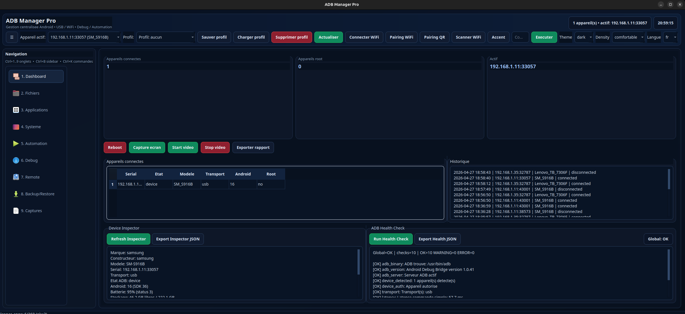
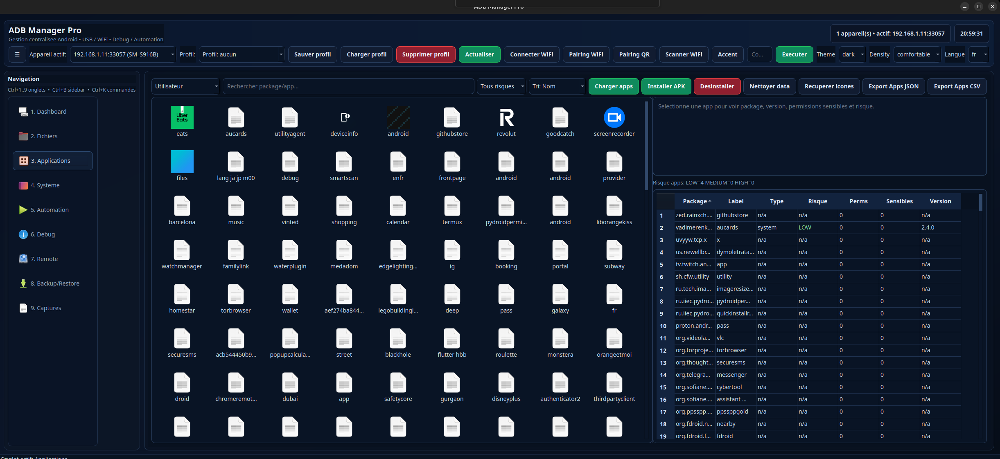
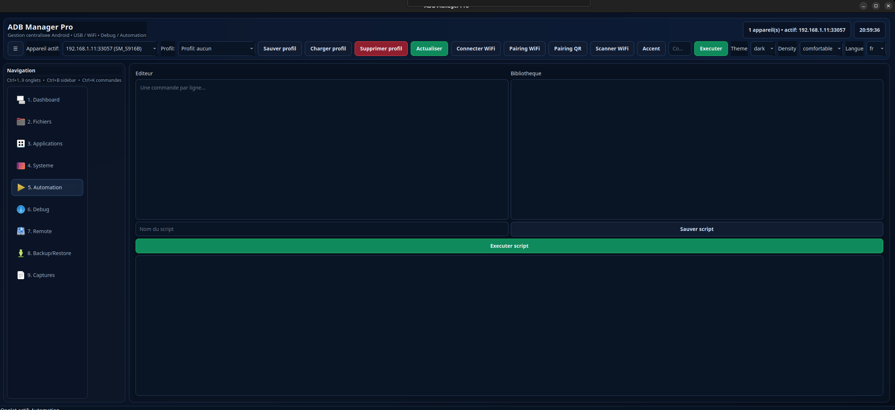
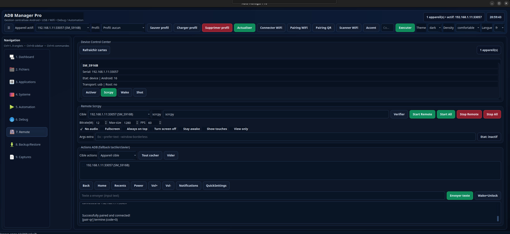
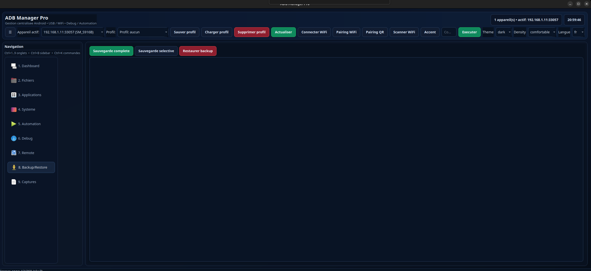
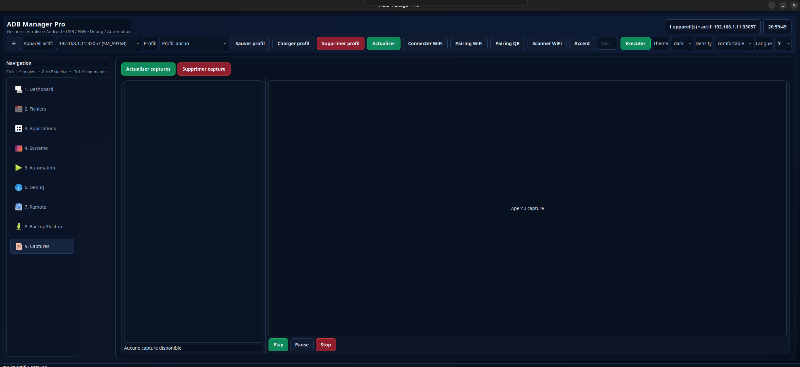

# ADB Manager Pro

[](https://github.com/SonFire03/adb_manager/actions/workflows/ci.yml)
[](https://github.com/SonFire03/adb_manager/actions/workflows/ci.yml)
[](https://github.com/SonFire03/adb_manager/releases)

> Current focus: **v2.3 Operations Maturity Update** (transfer presets, fleet health overview, health timeline chart/filters).

Console desktop Android (PySide6) pour administration, debugging et automatisation locale via ADB.

ADB Manager Pro vise un usage **ops/dev quotidien**: multi-device USB/Wi-Fi, diagnostics, audit trail, comparaison de snapshots, gestion apps/fichiers, remote control et automatisation.

## Pourquoi ce projet

- Centraliser les opérations ADB dans une UI claire et productive.
- Réduire les erreurs humaines (safe mode, confirmations, diagnostics).
- Fournir des artefacts traçables (session reports, exports JSON/HTML/CSV).
- Offrir un repo mature et démontrable (CI, changelog, contribution/security docs).

## Features clés

### Device & Connectivity
- Auto-détection multi-appareils USB/Wi-Fi.
- Pairing Wi-Fi (`adb pair`) + QR helper optionnel.
- Device Inspector détaillé (brand/model, Android, batterie, stockage, IP, écran, debug/root).
- ADB Health Check (statut global `OK/WARNING/ERROR`, checks détaillés, remédiations).

### Operations & Debug
- **Data Transfer Center**:
  - device -> host / host -> device,
  - presets (`Photos & Videos`, `Documents`, `Downloads`, `DCIM`, `Screenshots`, `Custom folders`),
  - saved custom transfer presets (save/load/delete),
  - transfer queue, per-task status, progress, dry-run preview,
  - JSON/HTML transfer report export,
  - integration with audit trail.
- Explorateur fichiers local ↔ device (dual pane, navigation, push/pull).
- Gestion applications + App Risk View (permissions sensibles, score `LOW/MEDIUM/HIGH`).
- Terminal ADB + logcat live.
- Batch executor (parallelisme, retry, timeout, pause/stop).
- Captures écran/vidéo avec preview intégrée.
- Remote control via scrcpy + fallback ADB actions.

### Traceability & Compare
- **Session Reports / Audit Trail**:
  - sessions horodatées,
  - événements d’actions (fichier/app/debug/capture/batch/script/system),
  - filtres (session/device/type/date),
  - export JSON + HTML.
- **Snapshot Compare**:
  - capture snapshot appareil,
  - diff packages installés/supprimés,
  - variations stockage / CPU / mémoire,
  - changements propriétés système et état device,
  - export diff JSON + HTML.
- **Device Health Checks** (functional health, non-certified):
  - battery / storage / CPU-memory / thermal / connectivity / ADB stability / app stability hints,
  - score global (`Healthy`, `Needs Attention`, `Degraded`, `Critical`),
  - findings structurés (severity, status, evidence, remediation),
  - export JSON/HTML,
  - health timeline par appareil (historique des scores + export CSV),
  - mini chart intégré pour visualiser la tendance de score,
  - filtres timeline (device + date range),
  - fleet health overview (dernier score/statut/check par appareil),
  - run health checks multi-appareils (run all devices).

## Architecture (rapide)

```text
adb_manager/
├── main.py
├── core/              # adb runner, parsing commands, device manager, utils
├── modules/           # logique metier (apps, inspector, health, audit, snapshots...)
├── gui/               # fenetre principale, widgets, styles
├── config/            # settings, commandes/scripts perso
├── tests/             # unittest
├── docs/              # docs et templates release
└── .github/           # CI + templates issue/PR
```

## Installation

Pré-requis:
- Python 3.10+
- Android Platform Tools (`adb`) dans le `PATH`
- Débogage USB ou sans fil activé sur l’appareil
- Appareil autorisé (popup RSA validé)

```bash
python3 -m venv .venv
source .venv/bin/activate
pip install -r requirements.txt
python main.py
```

## Safe usage (important)

ADB Manager Pro est un outil d’administration locale et de debugging.

- Nécessite une autorisation explicite sur le device (RSA / debug).
- Ne fournit **aucun** bypass de sécurité, contournement root, ni exploitation.
- Ne doit être utilisé que sur des appareils possédés ou explicitement autorisés.
- Les fonctionnalités d’analyse (Health Check, App Risk) sont informatives, pas un scanner offensif.
- Les `Device Health Checks` sont des **indicateurs techniques fonctionnels** basés sur ADB/dumpsys/logcat.
  Ce n'est pas un diagnostic matériel certifié constructeur.

## Screenshots (v2/v2.3)

Interface principale:





Reports / traçabilité:






## Tests

```bash
python -m unittest discover -s tests -v
```

## Release engineering

- CI GitHub Actions: `.github/workflows/ci.yml`
- Changelog: `CHANGELOG.md`
- Contribution guide: `CONTRIBUTING.md`
- Security policy: `SECURITY.md`
- Release notes template: `docs/release/RELEASE_NOTES_TEMPLATE.md`

## Roadmap (next)

- enrichir les comparaisons snapshots (granularité process/service),
- améliorer la visualisation audit (charts + agrégats),
- packaging release desktop (AppImage/Windows/macOS),
- documentation opératoire avancée (playbooks).

## Licence

Ajouter une licence explicite (MIT recommandé) avant diffusion plus large.
