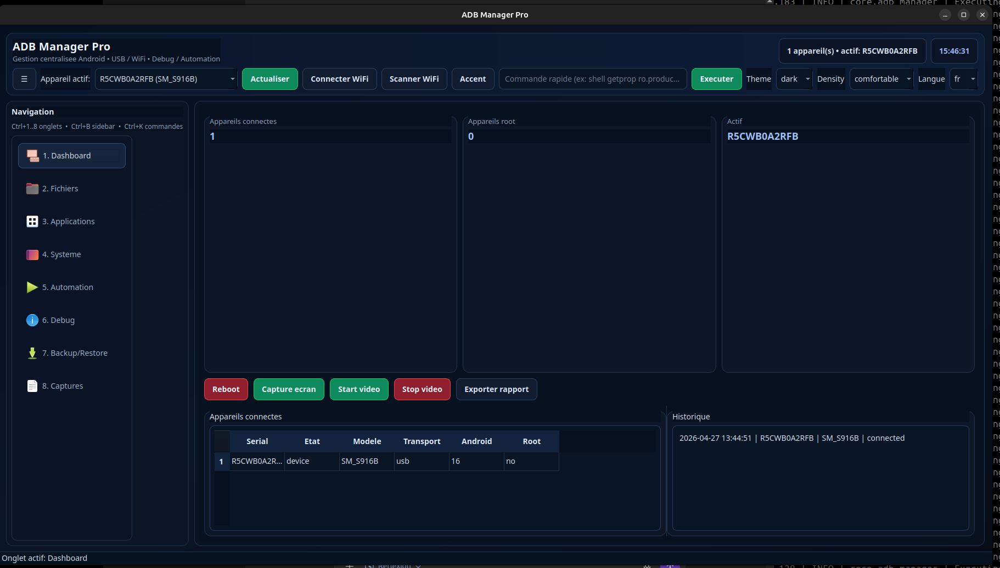
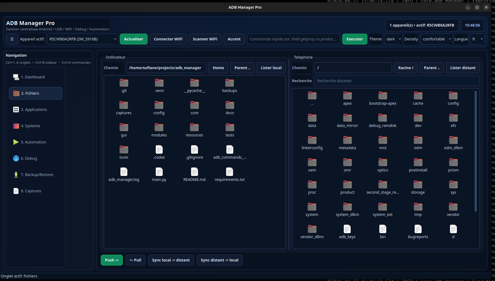
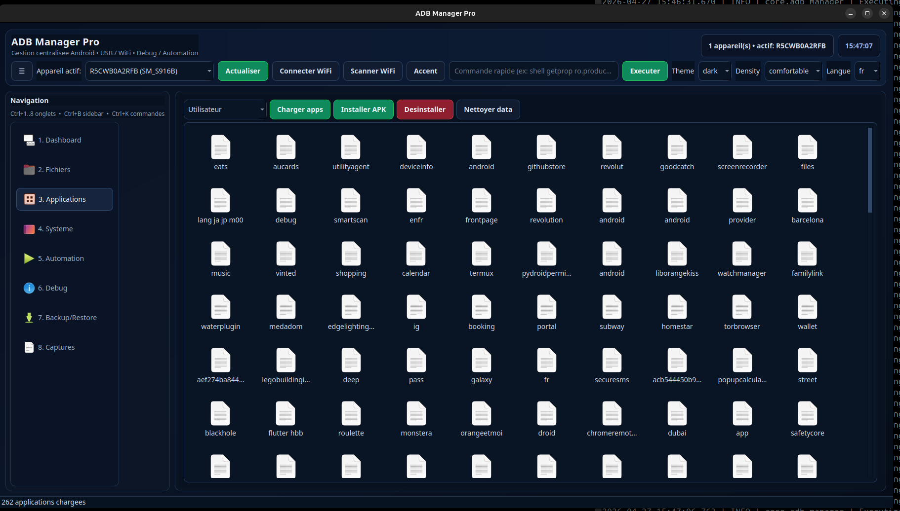
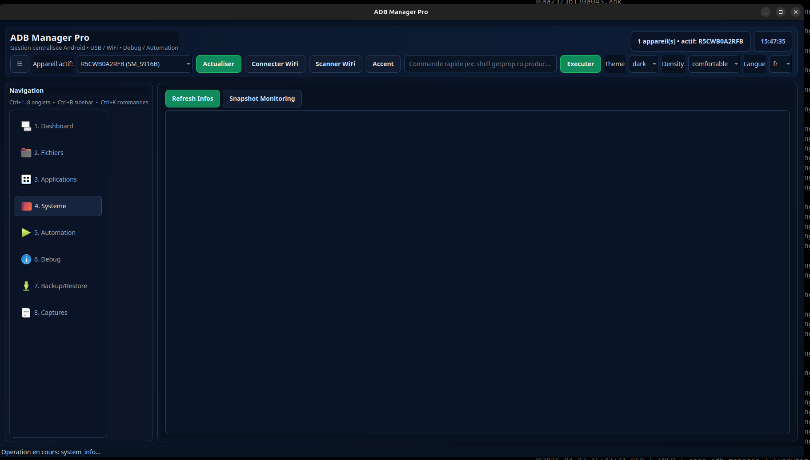
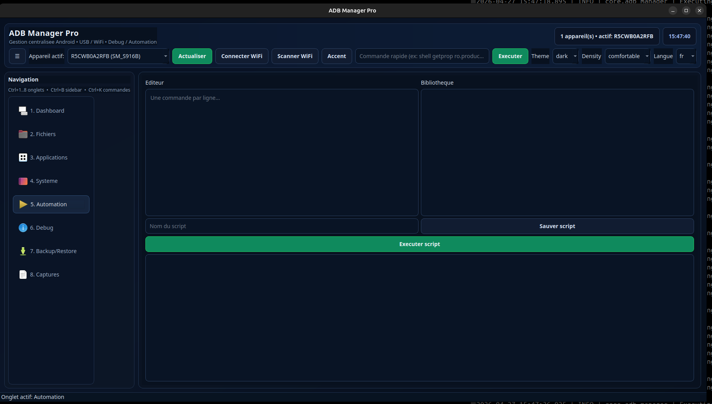
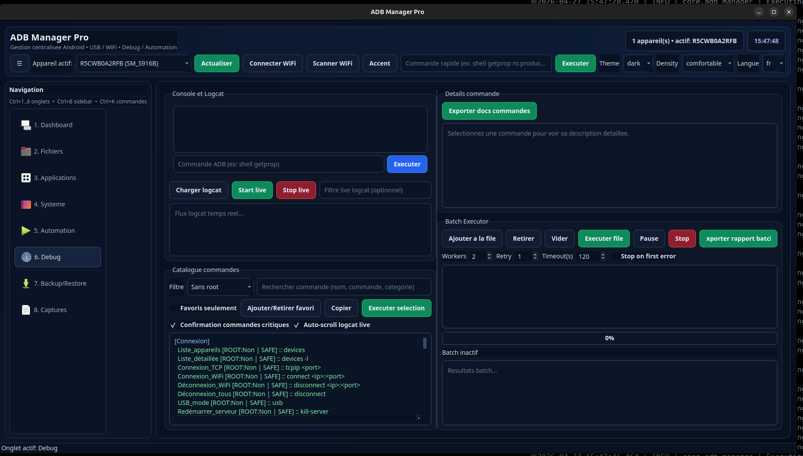
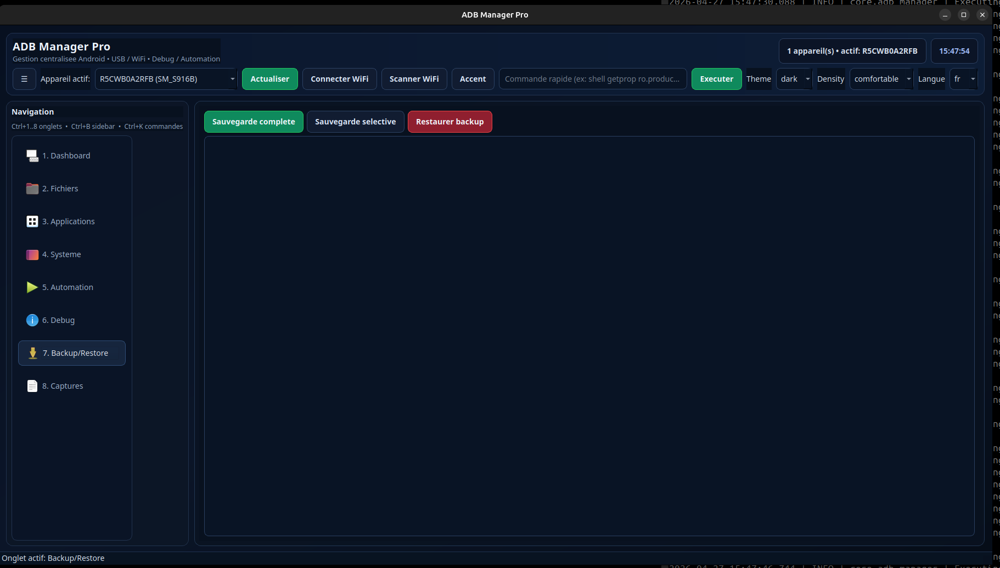
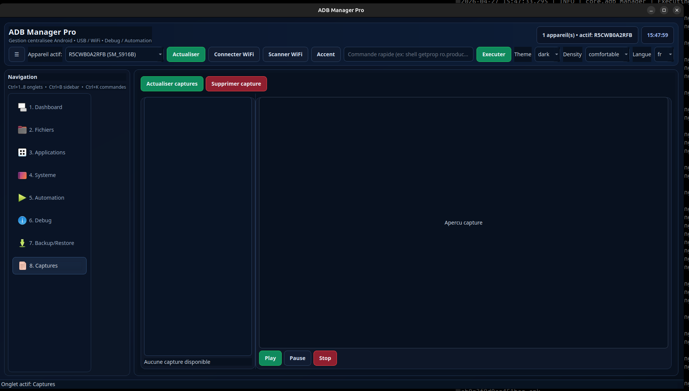

# ADB Manager Pro

Application desktop Python (PySide6) pour piloter Android via ADB avec une interface moderne, modulaire et orientée production.

- Multi-appareils USB/Wi‑Fi
- Explorateur fichiers local/distant en double panneau
- Gestion applications (grille d'icônes + actions batch)
- Monitoring système, terminal debug, logcat live
- Automatisation scripts et batch executor avancé
- Captures écran/vidéo + aperçu intégré

---

## Sommaire

1. [Objectif](#objectif)
2. [Fonctionnalités](#fonctionnalités)
3. [Architecture du projet](#architecture-du-projet)
4. [Prérequis](#prérequis)
5. [Installation](#installation)
6. [Lancement](#lancement)
7. [Guide d'utilisation](#guide-dutilisation)
8. [Sécurité et confidentialité](#sécurité-et-confidentialité)
9. [Commandes ADB et catalogue](#commandes-adb-et-catalogue)
10. [Captures d’écran](#captures-décran)
11. [Configuration](#configuration)
12. [Tests](#tests)
13. [Troubleshooting](#troubleshooting)
14. [Roadmap](#roadmap)
15. [Licence](#licence)

---

## Objectif

`ADB Manager Pro` fournit une couche UI complète au-dessus d’ADB pour:

- accélérer les opérations quotidiennes Android,
- réduire les erreurs humaines (confirmations critiques, safe mode),
- offrir une expérience utilisable par débutants et experts,
- rester extensible (catalogue commandes externe, modules séparés).

---

## Fonctionnalités

### 1) Connexion et appareils

- Détection auto périodique (`adb devices -l`)
- Badge appareil actif en temps réel
- Connexion Wi‑Fi ADB (IP/port)
- Scan réseau ADB (subnet)
- Historique SQLite des événements

### 2) Gestionnaire de fichiers

- Double panneau: local ↔ téléphone
- Navigation en grille avec icônes (dossiers/fichiers)
- Boutons `Home`, `Parent`, `Racine /`
- Navigation par double-clic
- Recherche distante
- Push/Pull
- Sync navigation locale/distance (niveau équivalent)

### 3) Gestion applications

- Liste apps utilisateur/système
- Vue grille avec icônes applicatives
- Extraction d’icônes APK (cache local)
- Install / uninstall / clear data
- Utilisation du package réel en backend (actions fiables)

### 4) Système / Monitoring

- Snapshot infos système Android
- Snapshot monitoring CPU/MEM
- Export rapport JSON

### 5) Automation

- Éditeur scripts ADB
- Bibliothèque scripts JSON
- Exécution script séquentielle

### 6) Debug avancé

- Terminal ADB avec auto-complétion
- Logcat live (start/stop + filtre + auto-scroll)
- Catalogue commandes riche:
  - catégories,
  - recherche,
  - favoris,
  - niveau root,
  - niveau risque,
  - domaine inféré,
  - placeholders `<...>`
- Confirmation renforcée sur commandes critiques
- Export documentation commandes (`.md` / `.pdf`)

### 7) Batch Executor

- File de commandes (drag & drop)
- Exécution parallèle configurable (`workers`)
- Retry, timeout, stop on first error
- Pause / reprise / stop
- Progression live + métriques
- Export rapport batch JSON

### 8) Captures

- Screenshot appareil
- Enregistrement vidéo écran Android
- Aperçu image/vidéo intégré

---

## Architecture du projet

```text
adb_manager/
├── main.py
├── core/
│   ├── adb_manager.py
│   ├── commands.py
│   ├── device_manager.py
│   ├── plugin_manager.py
│   └── utils.py
├── gui/
│   ├── main_window.py
│   ├── styles.py
│   └── widgets/
│       ├── code_editor.py
│       ├── terminal_widget.py
│       └── toast.py
├── modules/
│   ├── app_manager.py
│   ├── automation.py
│   ├── backup_restore.py
│   ├── file_manager.py
│   └── system_info.py
├── config/
│   ├── settings.json
│   ├── commands.json
│   └── scripts.json
├── resources/
│   ├── icons/
│   └── themes/
├── tests/
│   ├── test_commands.py
│   └── test_utils.py
├── docs/
│   └── screenshots/
├── tools/
│   └── capture_ui_screenshots.py
└── requirements.txt
```

### Rôles

- `core/adb_manager.py`: exécution commandes ADB sync/async + safe mode
- `core/device_manager.py`: polling appareils + connectivité Wi‑Fi
- `core/commands.py`: parsing et enrichissement du catalogue ADB
- `modules/*`: logique métier par domaine
- `gui/main_window.py`: orchestration UI + interaction modules
- `gui/styles.py`: thèmes et densité
- `config/*`: paramètres persistants

---

## Prérequis

- Python 3.10+
- Android Platform Tools (`adb`) accessible dans le `PATH`
- Débogage USB activé sur le téléphone
- Autorisation RSA validée côté appareil

Optionnel:
- Appareil rooté pour commandes root

---

## Installation

```bash
python3 -m venv .venv
source .venv/bin/activate
pip install -r requirements.txt
```

Dépendances principales:

- `PySide6`
- `qdarkstyle`

---

## Lancement

```bash
source .venv/bin/activate
python main.py
```

---

## Guide d'utilisation

### Démarrage rapide

1. Brancher l’appareil Android (USB) ou connecter en Wi‑Fi ADB.
2. Cliquer `Actualiser`.
3. Vérifier l’appareil actif dans le bandeau.
4. Utiliser les onglets selon besoin.

### Raccourcis

- `Ctrl+1..8`: navigation onglets
- `Ctrl+B`: afficher/masquer sidebar
- `Ctrl+K`: focus recherche commandes (palette rapide)

### Flux fichiers recommandé

1. Se placer sur dossier local cible.
2. Se placer sur dossier distant cible.
3. `Push` ou `Pull`.
4. Utiliser `Sync local -> distant` / `Sync distant -> local` pour rester aligné.

### Flux debug recommandé

1. Filtrer le catalogue commandes.
2. Lire `Details commande` (risque + astuce).
3. Exécuter via `Executer selection`.
4. Si critique: confirmation explicite requise.

---

## Sécurité et confidentialité

Le projet est préparé pour publication sans données personnelles.

### Mesures appliquées

- Exclusion des artefacts sensibles via `.gitignore`:
  - `adb_manager.log`
  - `config/history.db`
  - `backups/`
  - `captures/`
  - environnements virtuels
- Safe mode actif par défaut (`app.safe_mode = true`)
- Blocage commandes destructrices connues en mode sécurisé
- Confirmation des commandes critiques dans l’UI

### Avant publication (checklist)

- [ ] Vérifier qu’aucun log runtime n’est tracké
- [ ] Vérifier qu’aucun backup Android n’est présent
- [ ] Vérifier que `config/history.db` est absent
- [ ] Vérifier qu’aucune IP privée sensible n’est hardcodée

---

## Commandes ADB et catalogue

Le catalogue est alimenté par:

1. `adb_commands_complete.txt` (prioritaire)
2. fallback interne (`core/commands.py`)

Chaque commande expose:

- nom
- catégorie
- commande ADB
- statut root
- description
- placeholders
- niveau de risque
- domaine fonctionnel
- astuce d’usage

---

## Captures d’écran

Captures actuelles du projet (dossier `screen/`):










Génération automatique (optionnelle) de nouvelles captures:

```bash
source .venv/bin/activate
python tools/capture_ui_screenshots.py
```

---

## Configuration

Fichier principal: `config/settings.json`

Exemples clés:

- `app.theme`: `dark` / `light`
- `ui.density`: `comfortable` / `compact`
- `app.accent`: couleur d’accent
- `adb.default_timeout`
- `app.safe_mode`
- `ui.batch_workers`, `ui.batch_retry`, `ui.batch_timeout_s`

---

## Tests

```bash
python -m unittest discover -s tests -v
```

---

## Troubleshooting

### `adb` introuvable

- Installer Android Platform Tools
- Vérifier `which adb`

### Appareil `unauthorized`

- Rebrancher USB
- Accepter l’empreinte RSA sur Android
- `adb kill-server && adb start-server`

### Plugin Qt `xcb` introuvable (Linux)

Installer dépendances système Qt/XCB manquantes (ex: `libxcb-cursor0` selon distro).

### Commande root impossible

- Vérifier statut root de l’appareil
- Tester `adb shell su -c id`

---

## Roadmap

- Prévisualisation média enrichie (thumbnail vidéo)
- Synchronisation dossiers avec stratégies (`mirror`, `two-way`)
- Plugin system plus avancé
- Profiler application Android intégré

---

## Licence

Choisir une licence (`MIT` recommandé) avant diffusion publique si nécessaire.
